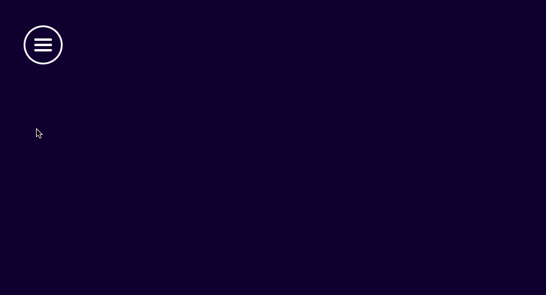

# Nimbl3 Design Lab - August 2018

A blend of the following concepts:

* Material design animation with the animated background color change (from dark blue to red) 
* Often-seen animated hamburger menu from three bars to a cross. But here with a twist as the middle bar becomes the underline 
for the active menu item. The idea is that the active menu item would always be the first menu item on each page.

All animations made in CSS ❤️ with a sprinkle of Javascript for some event handling 💊.

## Resources & Tools

* Menu design done by [Oncel](https://github.com/lemberalla) 
* [Codepen](http://codepen.io/) for inspiration 🙌

---

## The Instructions
For this Design Lab session, we challenge you to design or build an animated web / mobile navigation for the new Nimble Website.
* Type of animation: Video, gif or coded
* Upload the animation to https://invis.io/Q9ND2HSVP2C project or Github 
* Navigation content: Home - Our Work - Our Services - Culture - Blog
* Main purpose is to see the animation. No extra design work required. 
* There is no limit in submission per person. So you can do as many submissions as you want.
* This needs to be custom work!

## How does the challenge work?
* Registration & submission: August 6 → Aug 31
* Voting and winner announced: Aug 31

## Prize
50 USD worth Amazon Gift Card
